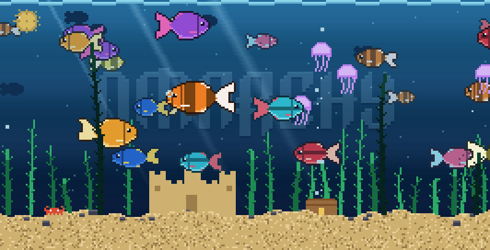

# omarchy-fishtank-screensaver

An 8-bit fish tank that runs as the Omarchy screensaver.



Everything is drawn with half-block characters (`▀`) and truecolor, so one
terminal cell holds two square pixels and the whole thing is pixel art rather
than ASCII art. No dependencies beyond Python 3.

The Omarchy wordmark is etched into the back wall of the tank, read straight
from `$OMARCHY_PATH/logo.txt`. It is block art, so one character cell maps
onto two pixels and it lands on the pixel grid exactly. Thick strokes catch a
highlight on top and drop a shadow underneath, which makes it read as carved
glass rather than a sticker pasted on the water.

`--logo lockup` stacks the mark from `icon.txt` above the wordmark instead.
The mark is built on a 4x4 pixel grid, so it is only ever shrunk by a whole
number -- a fractional resize smears those strokes into grey mush. A tall tank
gets it at full size; a short one halves it so the lockup still fits above the
sand.

Everything is sized from the tank rather than in fixed pixels: fish are a
fraction of the canvas height, with the ones far back small and dim and the
ones near the glass large, and the logo shrinks to fit a narrow tank. The
castle, chest, pufferfish and jellyfish are generated at whatever size the
tank has room for, rather than drawn once and doubled -- doubling only some
of the art put chunky pixels next to smooth ones, which reads as two
different pictures on the same screen. One pixel size everywhere, at any
resolution.

The tank has front-to-back depth: shapes too far away to have colour drift
across the back wall, and a few fronds close to the glass pass in front of
everything, darker and bluer the way a near foreground goes.

Swimming in the tank: generated fish species (each with a forked tail
that flaps, a dorsal fin, a gill line and a proper eye), a pufferfish, drifting
jellyfish, a crab that patrols the sand, bubbles from fish mouths and sand
vents, swaying seaweed, a sandcastle, a treasure chest, god rays from the
surface, drifting plankton and a rippling waterline.

## Terminal size

Omarchy opens the screensaver terminal at font size 18. That suits text
effects, but it leaves the tank about 96x60 pixels on a scaled laptop panel --
a quarter of what an everyday terminal gives -- and the fish come out coarse
and few. So the install also shadows `omarchy-launch-screensaver`, which opens
it at size 12 instead: roughly 160x90 pixels on that same panel and 266x136 on
a 1440p monitor.

```bash
printf -- '--font-size 10\n' > ~/.config/fishtank.conf   # finer still
printf -- '--font-size 18\n' > ~/.config/fishtank.conf   # Omarchy's original grid
```

The shadow does not copy Omarchy's launcher -- its multi-monitor handling
belongs upstream and should keep working through updates. It points
`OMARCHY_PATH` at a mirror of Omarchy's tree, every entry symlinked back to
the original except the terminal's screensaver config, which is ours, and then
hands off to the real launcher. That is the only thing the launcher reads
`OMARCHY_PATH` for. Ghostty and Kitty take their font size as a command-line
flag the launcher sets itself, so those two keep size 18.

## Keys

Four keys do things while the tank is running; every other key exits, so the
screensaver still behaves itself. They work the same when you run `fishtank`
in a terminal by hand.

| Key | Does |
| --- | --- |
| F1 | Next installed theme -- walks every theme in `~/.config/omarchy/themes` and `$OMARCHY_PATH/themes` |
| F2 | Back to the theme the desktop is wearing |
| F3 | Cycle the back wall: wordmark, lockup, mark, nothing |
| F4 | Feed the fish |

F1, F2 and F3 name what they just picked in the top-left corner, in the tank's
own pixels, and the text fades out after two seconds. **What you pick is what
the tank opens with next time** -- it is written to
`$XDG_STATE_HOME/fishtank/state.json` and read at startup, so you can leave
the screensaver on the theme you liked. A flag on the command line still wins
over the saved choice.

A screensaver runs one tank per monitor, and a keypress only reaches the
focused one, so each tank also watches that file and follows it. Press F1 on
one screen and the others change with it, and the choice that gets remembered
is the one you last made rather than whichever screen happened to be
focused.

Switching theme repaints the tank you were already watching rather than
generating a new one: the layout seed is held across the rebuild, so the same
castle, the same weeds, in new colours.

### Feeding

F4 sprinkles food across the surface. Flakes sink and wobble; every fish has
its own eyesight, between roughly 24 and 68 pixels, so the shoal notices in
dribs rather than turning as one -- the near ones dart up first, the rest
drift over as the food falls into their range. A fish that reaches a flake
eats it and lets out a bubble. Whatever makes it to the sand is the crab's:
it drops its patrol, hurries over and cleans up. Anything still uneaten after
25 seconds dissolves.

## Following your Omarchy theme

The tank paints itself from the Omarchy theme you are running, by default.

```bash
fishtank                    # the theme in use (or the last one you picked with F1)
fishtank --theme gruvbox    # try one on without switching to it
fishtank --no-theme         # the built-in aquarium palette instead
```

The palette comes from `omarchy-theme-color`, the same resolver every other
Omarchy consumer uses, so a third-party theme that only defines `color0..15`
still works. Colours are chosen by hue rather than by name -- matte-black
calls a red "yellow" and rose-pine calls a blue "green" -- so the water takes
the coolest colour in the theme, the sand the warmest, the plants the
greenest, and the fish whatever is left that is loud. A theme with no cool
hue at all gets an inky tank rather than a mis-tinted one, and in a light
theme the logo is cut into the water darker instead of lighter.

`omarchy-launch-screensaver` takes no arguments of its own, so anything you
want the screensaver to run with goes in `~/.config/fishtank.conf`, one flag
per line:

```bash
printf -- '--logo lockup\n--font-size 10\n' > ~/.config/fishtank.conf
```

`--font-size` is read by the launcher rather than passed to the tank; every
other line goes to `fishtank` as an argument.

## Install

```bash
git clone https://github.com/kimm-stensborg/omarchy-fishtank-screensaver.git
cd omarchy-fishtank-screensaver
./install.sh
```

That symlinks `bin/fishtank`, `bin/omarchy-screensaver` and
`bin/omarchy-launch-screensaver` onto a directory that comes earlier on `PATH`
than Omarchy's own copies, so the menu item and the shell's idle service both
find these first. Omarchy keeps doing the work -- one terminal per monitor,
right window class -- it just runs a fish tank in them.

Which directory that is depends on the machine, and `install.sh` works it out:

- Omarchy ships its commands as `/usr/bin/omarchy-*` and only *appends*
  `~/.local/bin` to `PATH`, so on a stock install a symlink there is never
  reached. Then `/usr/local/bin` is used instead, which needs `sudo`.
- If you prepend `~/.local/bin` yourself, no root is needed and that is used.

`--user` and `--system` force either. Whichever it picks, it finishes by
printing what `omarchy-launch-screensaver` now resolves to from both the login
shell (where the menu runs it) and the Wayland session (where the idle service
does), and fails loudly rather than leaving you with symlinks that are never
reached:

```
  login: /usr/local/bin/omarchy-launch-screensaver  (the fish tank)
  session: /usr/local/bin/omarchy-launch-screensaver  (the fish tank)
```

Nothing under `/usr/share/omarchy` is touched, so an `omarchy update` will not
fight with it, and `./uninstall.sh` hands the screensaver straight back to
stock.

Omarchy has no channel of its own for sharing screensavers: officially you
swap the ASCII art (`omarchy branding screensaver`), and the shell's plugin
system is for Quickshell components, which this is not. So this follows what
other third-party screensavers do -- a git repo and an install script that
points the screensaver at another program. Shadowing the binary on `PATH` is
the lightest version of that: no shell plugin is cloned, no launcher is
rewritten, and idle timing, "stay awake" and the lock screen keep working
exactly as they were.

Try it:

```bash
omarchy-launch-screensaver force   # the real thing, any key exits
fishtank                           # just the tank, Ctrl-C exits
```

### Requirements

Omarchy 4, Python 3 (no third-party modules), and a terminal the stock
screensaver already supports: Alacritty, Foot, Ghostty or Kitty. Truecolor is
assumed, which all four do.

## Uninstall

```bash
./uninstall.sh            # back to the stock Omarchy screensaver
./uninstall.sh --purge    # and delete ~/.config/fishtank.conf too
```

It cleans both `~/.local/bin` and `/usr/local/bin` (asking for `sudo` only if
there is something of ours in the latter).

It removes the two symlinks and the saved F-key state, then checks what
`omarchy-launch-screensaver` will find from now on and prints it, exiting
non-zero if anything is still shadowing the stock binary. Since nothing else
was ever touched -- no files under `/usr/share/omarchy`, no plugin clone, no
edited launcher, no Hyprland config -- that is the whole of it: the next idle
timeout gives you Omarchy's own screensaver back.

It only deletes symlinks that point at a checkout of this project, so a
`fishtank` or `omarchy-screensaver` of your own in `~/.local/bin` is reported
and left alone. It is safe to run twice, and it works from any clone -- you do
not need the one you installed from.

## Options

```
fishtank [--theme [NAME] | --no-theme]
         [--fps N] [--fish N] [--seed N] [--frames N]
         [--logo wordmark|lockup|mark|PATH|none] [--logo-opacity F]
         [--exit-on-key] [--exit-on-unfocus CLASS]
```

| Flag | Meaning |
| --- | --- |
| `--theme` | Omarchy theme to paint the tank from; the one in use by default, or name one to preview it. |
| `--no-theme` | Use the built-in aquarium palette instead. |
| `--fps` | Frame rate, default 24. |
| `--fish` | How many fish; by default it scales with the size of the terminal. |
| `--seed` | Fixed layout, handy for screenshots. |
| `--frames` | Render N frames and quit (testing). |
| `--logo` | What to etch on the back wall: `wordmark` (the default), `lockup` for the mark above the wordmark, `mark`, a path to your own text art, or `none`. |
| `--logo-opacity` | How strongly it shows through, default `0.26`. |
| `--exit-on-key` | Quit on any keypress — screensaver mode. |
| `--exit-on-unfocus` | Quit when the given Hyprland window class loses focus. |

A full-screen tank costs 2.5 ms per frame at 160x90 and 5.6 ms at 266x136, so
at 24 fps one screen idles at 6-13% of a core. `--font-size` is the dial:
a finer grid looks better and costs more.

## Development

```bash
./test.sh [--quick]                                        # the checks
tools/preview.py out.png [cols] [rows] [seconds] [scale]   # one frame as a PNG
tools/sheet.py sheet.png [scale] [fish-width]              # every sprite, big

PREVIEW_THEME=gruvbox tools/preview.py out.png                # themed preview
PREVIEW_LOGO=lockup tools/preview.py out.png                  # pick the logo
PREVIEW_FEED=0.5 tools/preview.py out.png                     # mid-feed
PREVIEW_LABEL="tokyo night" tools/preview.py out.png          # with the corner label
```

`test.sh` is worth running after any change to the drawing: every case in it
stands for something that broke once -- a theme whose colours are named after
other colours, a canvas too small for the logo, symlinks that PATH never
reaches, a state file left over from a previous run.

The fish are generated rather than hand-drawn: `fish_art()` in `bin/fishtank`
paints a tail fan, a teardrop body over its root, fins, a pattern (`bands`,
`stripe`, `spots` or `plain`), a face, and then a dark outline around the lot.
A species is one row in `SPECIES` — body, belly, accent and pattern — so adding
a new fish is a one-line change. The hand-drawn sprites (puffer, jellyfish,
crab, castle, chest) are plain string art with a palette dict next to them.
