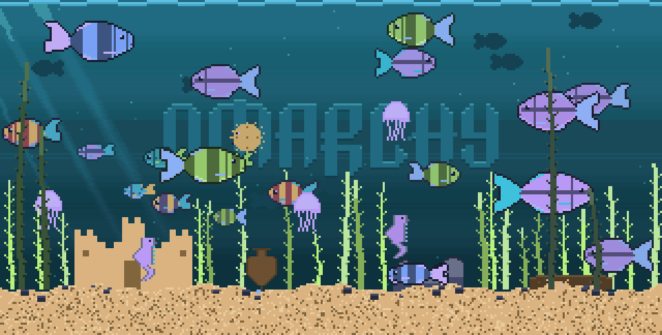

# Fish Tank

An 8-bit fish tank that runs as the Omarchy screensaver. It is drawn with
half-block characters and truecolor, so a terminal cell holds two square
pixels and the whole thing is pixel art rather than ASCII art. It takes its
colours from the Omarchy theme you are running, spreads one ocean across your
monitors, and can be fed.



- **License:** MIT
- **Requires:** Omarchy 4 (Quattro), Python 3, and one of Alacritty, Foot,
  Ghostty or Kitty

## Install

```bash
git clone https://github.com/kimm-stensborg/omarchy-fishtank-screensaver.git
cd omarchy-fishtank-screensaver
./install.sh
```

Omarchy keeps doing the work -- one terminal per monitor, right window class,
the same idle timing and the same lock screen. The install only shadows the
two commands it runs, on a directory that comes earlier on `PATH`, and leaves
everything else alone. Nothing under `/usr/share/omarchy` is touched, so an
`omarchy update` will not fight with it.

Which directory that is depends on the machine, and `install.sh` works it out.
Omarchy ships its commands as `/usr/bin/omarchy-*` and only *appends*
`~/.local/bin` to `PATH`, so on a stock install a symlink there is never
reached and `/usr/local/bin` is used instead, with `sudo`; if you prepend
`~/.local/bin` yourself, no root is needed. `--user` and `--system` force
either. It finishes by printing what `omarchy-launch-screensaver` now resolves
to, from both the login shell (where the menu runs it) and the Wayland session
(where the shell's idle service does), and fails rather than leaving you with
symlinks that nothing will reach.

Try it with **Omarchy menu → System → Screensaver**, or:

```bash
omarchy-launch-screensaver force   # the real thing, any key exits
fishtank                           # just the tank, Ctrl-C exits
```

## Use

Six keys do something while it runs; every other key exits, so the screensaver
still behaves itself. They work the same if you run `fishtank` in a terminal
by hand.

| Key | Does |
| --- | --- |
| `F1` | Next installed theme |
| `F2` | Back to the theme your desktop is wearing |
| `F3` | The logo on the back wall: wordmark, lockup, mark, nothing |
| `F4` | Feed the fish |
| `F5` | Flip the light: dark if it is light, light if it is dark |
| `Shift + F5` | Hand the light back to the day-and-night cycle |
| `F6` | The clock: 24-hour, 12-hour, off |

- **What you pick is remembered.** It is written to
  `$XDG_STATE_HOME/fishtank/state.json` and read at startup, so the tank opens
  the way you left it. A flag on the command line wins over the saved choice.
- **Every screen follows.** A keypress only reaches the monitor with focus, so
  each tank watches that file: press `F1` on one screen and the others change
  with it, and what gets remembered is the choice you last made rather than
  whichever screen happened to be focused.
- **Feeding.** `F4` sprinkles food across the surface of every monitor. Each
  fish has its own eyesight, so the shoal notices in dribs rather than turning
  as one -- the near ones dart up first and the rest drift over as the food
  falls into range. Whatever reaches the sand is the crab's: it drops its
  patrol, hurries over and cleans up.
- **Night.** Left alone, the tank has a day. Every fifteen minutes the light
  goes out of the water, the god rays thin to one shaft of moonlight,
  everything slows and the fish sink toward a resting spot -- and the
  jellyfish keep their colour and pick up a faint halo, being the one thing in
  there that makes its own light.
- **The clock** sits in the top-right corner, in the tank's own pixels, dimmed
  with the light so it does not glare after dark.
- **The keys announce themselves** the first few times the tank runs -- a line
  low in the water that fades after a few seconds, and stops appearing for
  good once you have pressed one of them.

## In the tank

- **Your theme.** The palette comes from `omarchy-theme-color`, the same
  resolver every other Omarchy consumer uses, so a third-party theme that only
  defines `color0..15` works too. Colours are chosen by hue rather than by
  name -- matte-black calls a red "yellow" and rose-pine calls a blue "green"
  -- so the water takes the coolest colour in the theme, the sand the warmest,
  the plants the greenest, and the fish whatever is left that is loud.
- **One ocean.** With more than one monitor the tanks are windows onto the
  same ocean: a fish that leaves the right edge of one screen arrives at the
  left edge of the next, at the moment it should, the right size and at the
  right depth. They manage it without talking to each other -- each tank works
  out which monitor it is on and where that monitor sits in the layout, and a
  travelling fish is a closed form of its number, a fixed seed and the wall
  clock, so every screen computes the same answer alone. The fish that belong
  to a screen turn back at the glass, so one leaving it has genuinely gone
  next door.
- **Life.** Generated fish species, each with a forked tail that flaps, a
  dorsal fin, a gill line and an eye. The smaller ones hold station on a shoal
  that drifts about the tank, breaking formation for food and settling back
  afterwards. Seahorses hang in the weeds, bottom feeders nose along the sand
  with their barbels out, a pufferfish drifts, jellyfish pulse, and a crab
  patrols the floor.
- **A floor that is different every time.** Two to five pieces picked from a
  sandcastle, a treasure chest, a boulder pile, branching coral, a sunken log
  and an amphora, each generated at a size that suits the tank. Fish swim over
  anything tall enough to be in the way, weeds keep out of the furniture, and
  bubbles rise from whichever pieces are hollow.
- **A predator.** Every few minutes something bigger cruises through, and the
  water in front of it empties: fish within reach bolt the other way and
  drift back once it has gone. It belongs to the screen it is on rather than
  to the ocean, so it comes and goes.
- **Depth.** Shapes too far away to have colour drift along the back wall, and
  a few fronds close to the glass pass in front of everything.
- **The Omarchy logo**, etched into the back wall from `logo.txt`, catching a
  highlight on top and dropping a shadow underneath so it reads as carved
  glass rather than a sticker.

## Settings

Omarchy's launcher takes no arguments of its own, so anything you want the
screensaver to run with goes in `~/.config/fishtank.conf`, one flag per line:

```bash
printf -- '--font-size 10\n--logo lockup\n' > ~/.config/fishtank.conf
```

`--font-size` is read by the launcher; every other line is passed to the tank.

| Flag | Meaning |
| --- | --- |
| `--font-size` | Terminal font size for the screensaver, default 12. Omarchy uses 18, which leaves the tank about 96x60 pixels on a scaled laptop panel; 10 is finer and costs more. Foot and Alacritty only -- Ghostty and Kitty take their size on the command line, where the launcher sets it. |
| `--theme` | Omarchy theme to paint the tank from; the one in use by default, or name one. |
| `--no-theme` | The built-in aquarium palette instead. |
| `--night` | Hold the light at a level from 0 to 1 instead of cycling. |
| `--no-night` | Keep the lights on. |
| `--clock` | `--clock`, `--clock 12` or `--no-clock`. |
| `--logo` | `wordmark` (default), `lockup`, `mark`, a path to your own text art, or `none`. |
| `--no-ocean` | Keep this screen's fish to itself. |
| `--feed` | Sprinkle food into every tank that is running, then exit. |
| `--fish` | How many fish; by default it scales with the tank. |
| `--fps` | Frame rate, default 24. |
| `--seed` | Fixed layout, handy for screenshots. |

A full-screen tank costs 1.6 ms per frame at 160x90 and 4.2 ms at 320x162, so
one screen idles at 4-10% of a core depending on `--font-size`. The scenery
and the sand are flattened into plain writes once rather than drawn each
frame, the logo is blended a row at a time rather than a pixel at a time, and
the renderer sends only the rows that changed.

## Uninstall

```bash
./uninstall.sh            # back to the stock Omarchy screensaver
./uninstall.sh --purge    # and delete ~/.config/fishtank.conf too
```

It removes the symlinks and the saved state, then prints what
`omarchy-launch-screensaver` will find from now on. It only deletes symlinks
pointing at a checkout of this project, works from any clone, and is safe to
run twice.

## Development

```bash
./test.sh [--quick]                                           # the checks
tools/preview.py out.png [cols] [rows] [seconds] [scale]      # a frame as a PNG
tools/make_gif.py out.gif [cols] [rows] [secs] [scale] [fps]  # animated
tools/sheet.py sheet.png [scale] [fish-width]                 # every sprite, big

PREVIEW_THEME=gruvbox PREVIEW_NIGHT=1 tools/preview.py out.png
```

`test.sh` is worth running after any change to the drawing: every case in it
stands for something that broke once -- a theme whose colours are named after
other colours, a canvas too small for the logo, fish that swelled to fill a
coarse grid, symlinks on a `PATH` that never reaches them, a pufferfish with
nowhere to sleep.

The fish are generated rather than drawn by hand: `fish_art()` paints a tail
fan, a teardrop body over its root, fins, a pattern, a face, and then a dark
outline around the lot. A species is one row in `SPECIES` -- body, belly,
accent and pattern -- so adding one is a one-line change. The scenery,
pufferfish, jellyfish and seahorse are generated the same way, at whatever
size the tank has room for, which is what keeps one pixel size at every
resolution.
